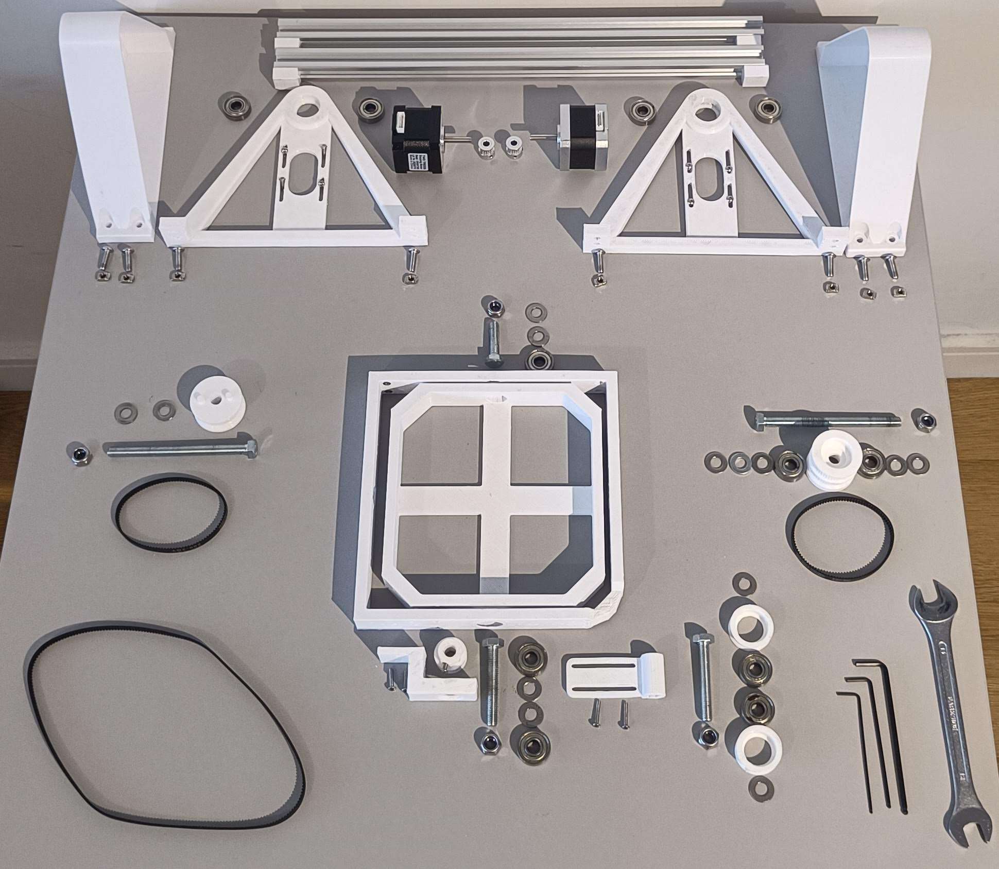

# OpenClino Build Guide

TODO
Add pictures and definitions
Electronics guide

## 3D Printing

All files are available in `3d_files/`. The parts can be printed in PLA but I prefer to use PETG.

All the parts are printed on an ender 3. I usually have to sand down the edges due to stringing etc.

Print temperatures will depend on your filament, but I personally prefer to use a brim.

The only part that needs supports is the m2y pulley.

## Hardware

The build of openclino usually takes 1-2 hours. Step 0 is make sure you make a coffee or your favourite hot/cold beverage.
We will build the sub assemblies: y_turn, bodies, and the base, and the final step 5 is to combine everything.

### Tools required:

    - Spanner/wrench: Number 13 metric (same as a skateboard).
    - Alan keys: 3 mm for the base.
                 2 mm for the motors and bodies.
                 1.5 mm for the motor pulley grub screw.

### Build Instructions:

    1 - Build y_turn.

        a) Place the washers between the nuts and the bearing.
           NOTE: Don't tighten the nuts too much as this will introduce a lot of unwanted friction.

    2 - Combining x and y bodies.
        a) Push fit bearings to the y_guide and the x body. 

        b) Install bolts through the y and xbody, make sure to put a washer in between the bodies!

        c) Install y_pulley and y_guide, with washers in between. 
           NOTE: Remember to add the y belt before the nut!
           The hex nuts can be push fit into the x body.
           Tighten the y_pulley grub screw so that it rotates with the y body.
           NOTE: the grub screw design of the y pully relies on a threaded insert that needs to be installed with a soldering iron.
                I will endeavor to make one that has an inserted hex nut.

        d) Install the y_turn into the x body. The hex nuts can be push fit into the x body.

        e) Ensure everything rotates smoothly. The Nylock nuts don't have to be tightened, just enough so that it doesn't shake.
    
    3 - x_pulley and m2y pulley.
        Now that x and y are combined, lets add the x_pulley and m2y pulley.

        a) x_pulley: push fit the x pulley into the body, and place washers in for now.

        b) m2y pulley: push fit two bearings into the m2y pulley and add washers for now.
           NOTE: the tricky part here is making sure the long belt doesnt scrape the motor, 
           so remember to keep the wider part of the m2y close to the x body, 
           and place 2 washers between the x body and the x body.

        We have now fully combined x and y bodies!

    4 - Build the base.
        a) Install the motor pulleys.
           Make sure to align the notch in the motor shaft with one of the grub screws in the pulley.
           Keep the motors loose for now as you will need to tension the belts later.
           Repeat for both sides.

        b) Install the motor to the motor mount using 4 hex screws.
           You can also push fit the bearings into the motor mount.
           Repeat for both sides.

        c) Push fit the bearings into the motor_mount and motor_enclosure.

        d) Install the enclosures and motor mounts to the aluminium rails.
           Keep all the screws loose for now, it will take a low of wiggling to align everything!

    5 - Final Assembly.
        You should now have two assemblies; the base, and the x+y bodies.

        a) Add the short belts to the x_pulley and m2y_pulley.

        b) Mount the x_body assembly to the base.
           Remember to add a washer between the pulleys and the motor_mount bearings.

        c) Tighten the long bolts but not too much, as it might break the mounts and enclosures.
           Again you don't want anything to be tight, make sure it all spins smoothly.

        d) Hook the short belts to the motor pulley.
           You will have to lift the motors up to attach the belt, then tension the belt and tighten the motor screws.

        e) This step is just to ensure that the y belt (short) m2y belt (long) don't interfere.
           This is the tightest tolerance in the clinostat.

        f) Finally, only after installing everything and ensuring both axes rotate smoothly should you tighten the base.

Make sure every pulley and axis rotates smoothly with the push of a pinky. If there is friction anywhere due to

## Electronics

I would recommend building this onto a breadboard so you are comfortable with the pieces before final soldering.

TODO

